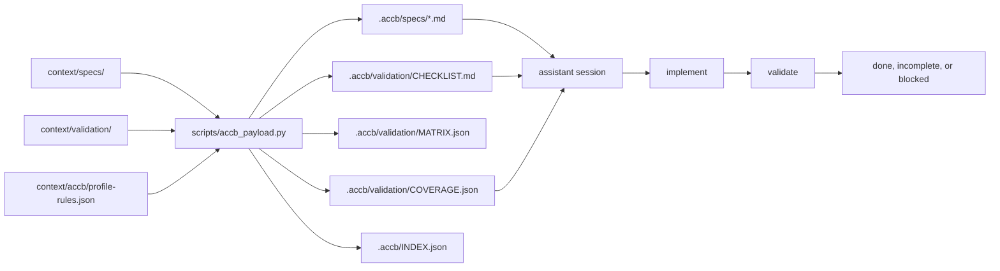
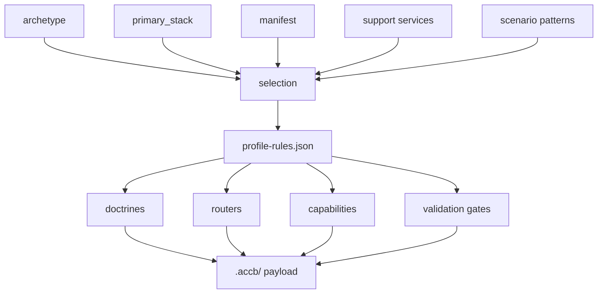
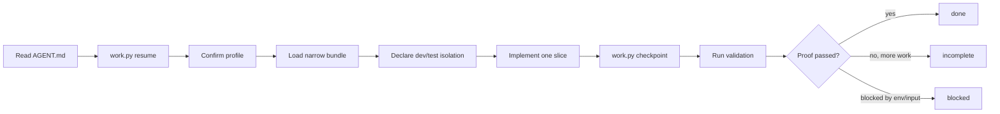
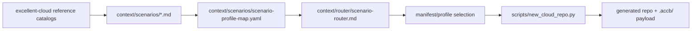
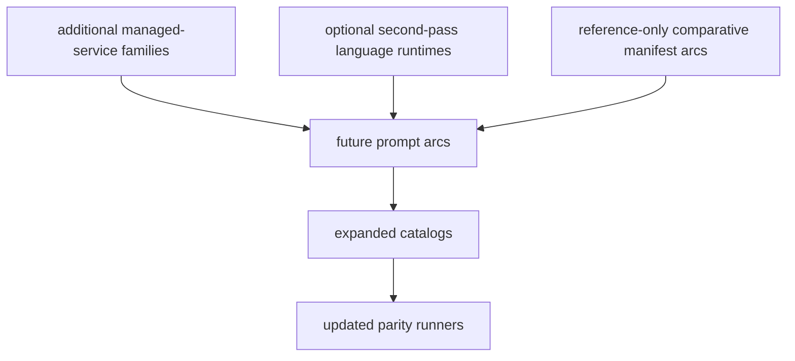

# Architecture Map

This is the shortest accurate map of how `accb` works.

## System Shape

`accb` turns a cloud workload request into a narrow, inspectable repo profile, then generates a derived repo with a `.accb/` payload that carries startup, validation, and continuity rules.

- Doctrine, anchors, routers, workflows, skills, archetypes, scenarios, and stacks live under `context/`.
- Manifests bind provider, runtime tier, language, IaC, examples, templates, and isolation declarations.
- `scripts/new_cloud_repo.py` generates derived repos.
- `scripts/accb_payload.py` composes `.accb/` payloads.
- `scripts/work.py` handles runtime continuity.
- Verification ties manifests, examples, generated payloads, IaC isolation, and parity runners together.

## Spec + Validation Flow

## `.accb/` Composition Flow

## Session Execution Loop

## Context Validation Layer

| Layer | Command | Role |
| --- | --- | --- |
| `budget_report` | `python3 scripts/work.py budget-report --bundle <files>` | Scores startup bundle breadth when the feature gate is enabled. |
| `startup_trace` | `python3 scripts/work.py startup-trace ...` | Records declared startup loading for auditability when enabled. |
| `route_check` | `python3 scripts/work.py route-check "<prompt>"` | Heuristically previews provider/runtime/task routing when enabled. |

## Cloud Capability Areas

| Area | Status | Overview |
| --- | --- | --- |
| Functions | Complete AWS/GCP/Azure canonical function arc with event, HTTP, queue, storage, identity, and replay examples | [`docs/functions-arc-overview.md`](functions-arc-overview.md) |
| Managed containers | Complete Cloud Run, App Runner, and Container Apps arc with APIs, workers, jobs, sidecars, Dapr, and VPC connectors | [`docs/containers-arc-overview.md`](containers-arc-overview.md) |
| Kubernetes | Complete EKS, GKE, and AKS multi-role platform arc with API, worker, job, cron, Helm, Kustomize, and provider identity | [`docs/kubernetes-arc-overview.md`](kubernetes-arc-overview.md) |

## Scenario Catalog Flow

## Future Direction

## Directory Index

| Path | Current role |
| --- | --- |
| [`context/`](../context) | Source context: doctrine, anchors, specs, validation, routers, workflows, skills, archetypes, scenarios, and stacks. |
| [`manifests/`](../manifests) | Profile bundles for generation and routing. |
| [`templates/`](../templates) | Starter files for generated repos. |
| [`scripts/`](../scripts) | Runtime, generation, composition, inspection, and verification commands. |
| [`examples/`](../examples) | Canonical examples and cross-cutting reference packs. |
| [`verification/`](../verification) | Registry, parity checks, policies, and script tests. |
| [`memory/`](../memory) | Durable concept history and gitignored session summaries. |
| [`docs/`](../docs) | Operator and architecture documentation. |

## Recommended Follow-On Reads

1. [`docs/usage/STARTING_NEW_PROJECTS.md`](usage/STARTING_NEW_PROJECTS.md)
2. [`docs/usage/SPEC_DRIVEN_ACCB_PAYLOADS.md`](usage/SPEC_DRIVEN_ACCB_PAYLOADS.md)
3. [`docs/context-boot-sequence.md`](context-boot-sequence.md)
4. [`docs/runtime-state-workflow.md`](runtime-state-workflow.md)
5. [`docs/usage/ASSISTANT_BEHAVIOR_SPEC.md`](usage/ASSISTANT_BEHAVIOR_SPEC.md)
