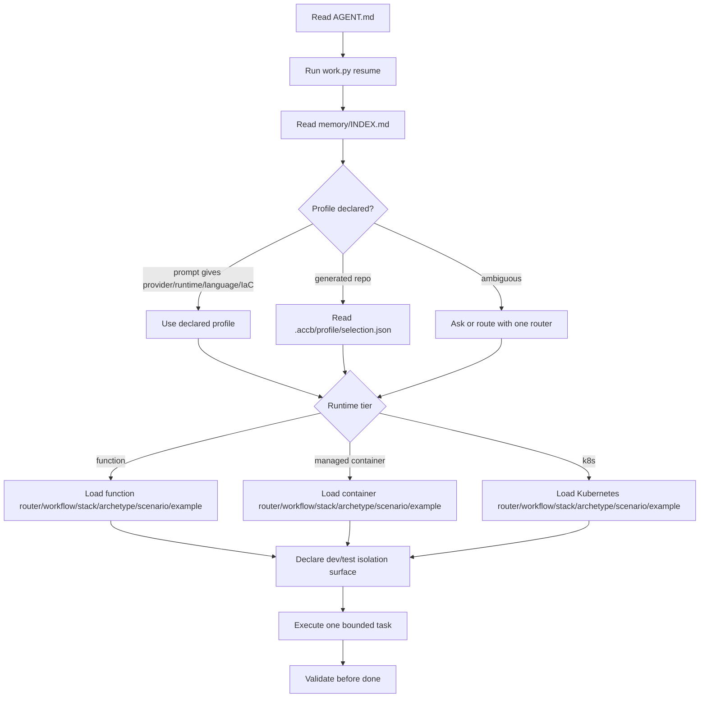

# Context Boot Sequence

Assistants must start from the smallest useful cloud profile and broaden only when the task proves ambiguity. This keeps provider, runtime tier, language, and IaC decisions explicit.

## Startup Contract

1. Read [`AGENT.md`](../AGENT.md).
2. Run `python3 scripts/work.py resume`.
3. Read [`memory/INDEX.md`](../memory/INDEX.md) and only the concept artifact relevant to the current task.
4. Confirm provider, runtime tier, language, and IaC tool from the user prompt or from `.accb/profile/selection.json` in a generated repo.
5. Load one router, one workflow, one stack pack, one archetype, one scenario pattern, and one canonical example.
6. Refuse to broaden the context bundle until ambiguity is resolved.

## Boot Flow

## Isolation Declaration

Before generating or changing cloud resources, declare the dev/test isolation surface:

- State: separate Terraform backends/workspaces or Pulumi stacks.
- Environment variables: distinct `ACCB_*_DEV_` and `ACCB_*_TEST_` prefixes.
- Secrets: distinct provider secret paths or vault locations.
- Resource naming: environment-suffixed names for managed resources.
