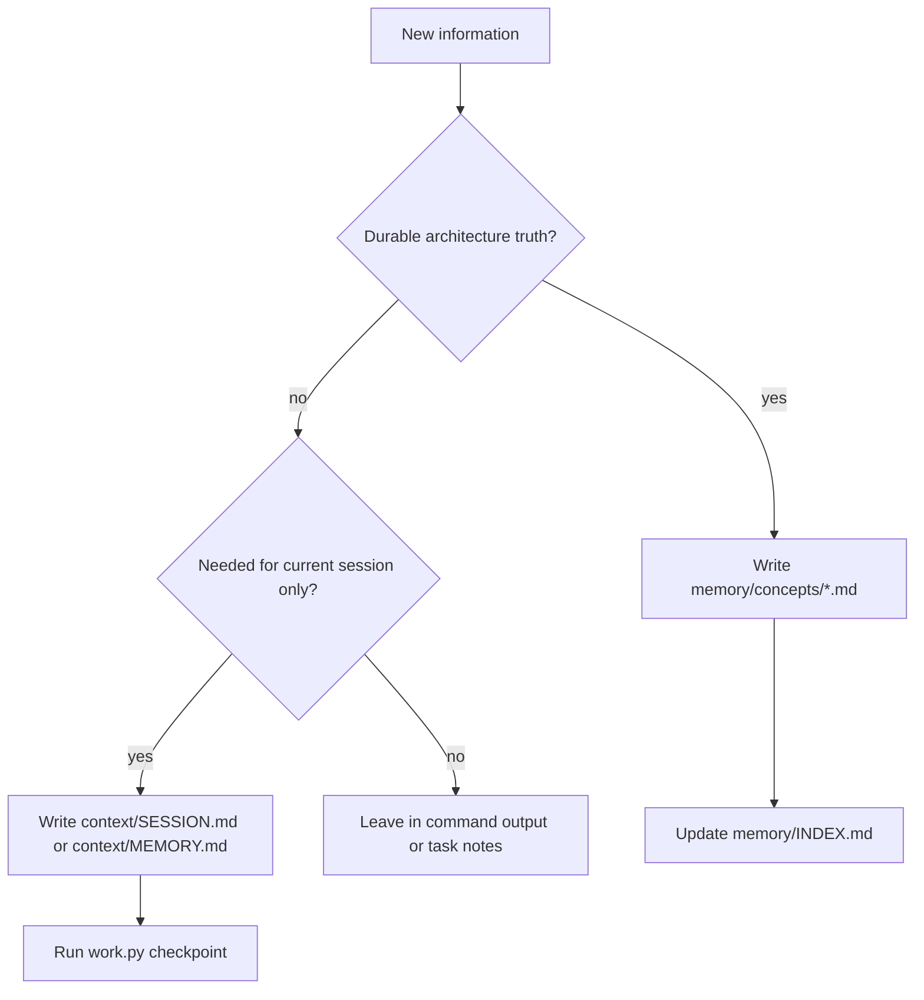

# Memory Layer Overview

The memory layer keeps long arcs understandable without turning local runtime notes into doctrine.

## Artifact Roles

| Location | Role | Tracked |
| --- | --- | --- |
| `memory/concepts/` | Durable concept artifacts from completed prompts and architectural milestones | yes |
| `memory/INDEX.md` | Index of tracked concept artifacts and tier descriptions | yes |
| `memory/sessions/` | Per-session logs managed by `work.py` | no |
| `memory/summaries/` | Per-prompt or checkpoint summaries managed by `work.py` | no |
| `context/MEMORY.md` | Repo-local current continuity notes | no, generated from example |

## Decision Flow

## INDEX Discipline

`memory/INDEX.md` lists every tracked concept artifact. It does not list individual files under `memory/sessions/` or `memory/summaries/` because those directories are gitignored runtime output; only their tier role belongs in the index.
